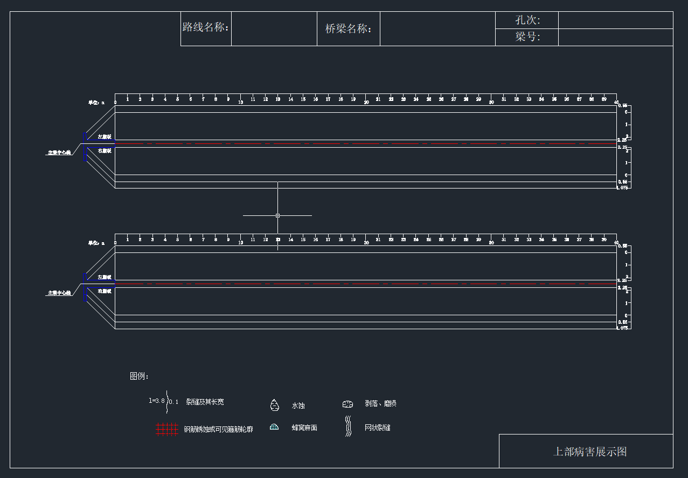
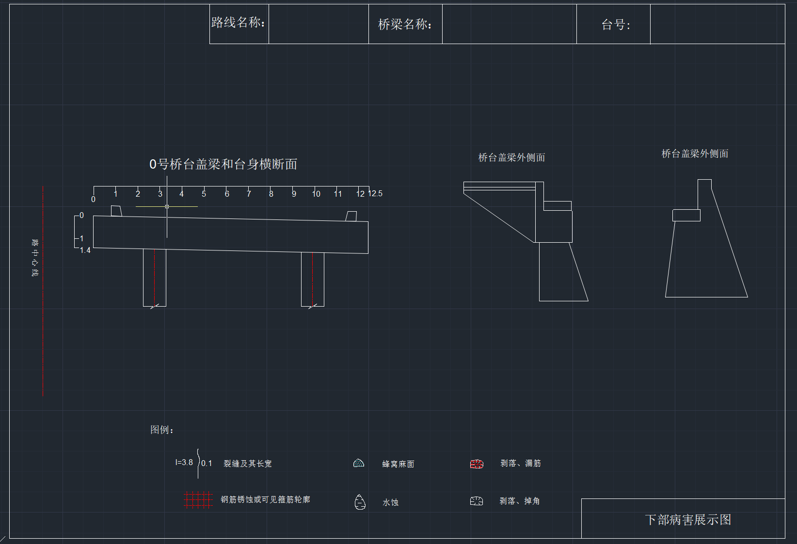
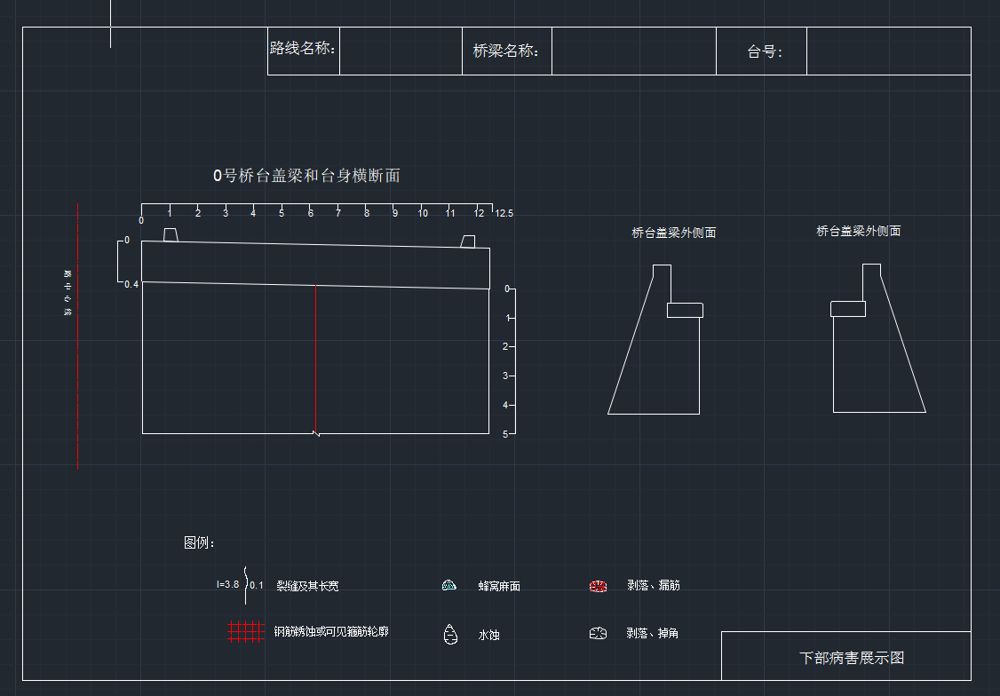
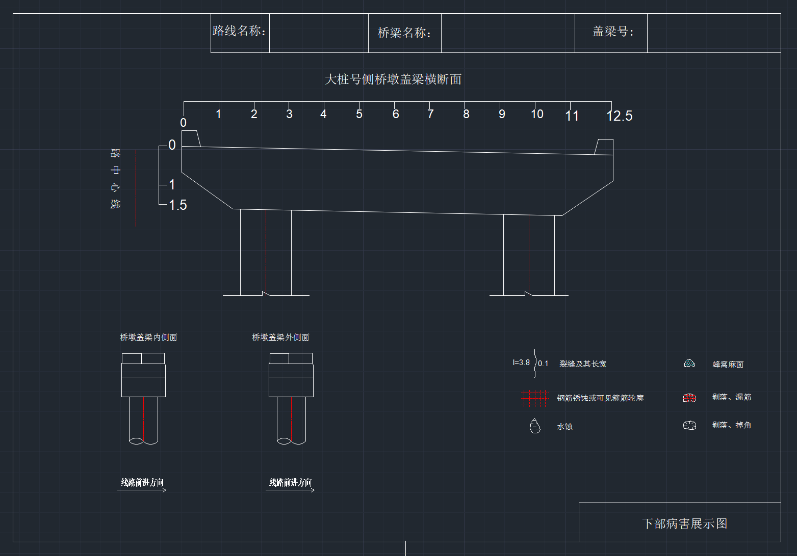

## 任务描述
我想开发读取桥梁构件病害记录的excel，桥梁构件的cad模板文件，然后把excel里的病害记录按照图例和坐标标注到对应的桥梁构件上。

## 输入
- excel文件（例如K572+774红石牡丹江大桥（右幅）病害.xlsx）
excel的每第一列序号，第二列是桥梁构件编号，第三列是构件名称。第四列是病害以及程度。同一个构件如果有N条病害就会有N条记录。我会有一个单独一行（例如底4行就是）是该构件对应的模板文件的名称，例如“上部（40mT梁）”对应的就是40mT梁.dxf文件。我们会读取这个文件，个这文件是两根T梁的模板

- 模板文件（例如./templates/构件/40mT梁.dxf）
上面有路线名称：就是excel顶部的路线名称。桥梁名称就是第二行的桥梁名称。孔次：就是构件编号的'-'前面的数字。梁号：就是构件编号。
    - 模板文件的位置:./templates/构件/*.dxf
    - 构件名称和模板文件的构件名称对应关系：
        - 构件名称：上部（40mT梁） =》模板文件：40mT梁.dxf
        - 构件名称： 下部（双柱墩）=》模板文件：双柱墩.dxf
        - 构件名称： 桥台（不带台身桥台） =》模板文件：不带台身桥台.dxf

## 处理过程
### 1. 读取excel文件到内存。

### 2. 把excel里的病害记录按照构件编号分组，每组两个构件。对应着模板的的一个图例的两个构件
- 一个excel表示一个桥梁。
- 一个桥梁的所有图都必须放到一个cad结果文件中。
- 一个cad文件中有很多图。每张图都纵向排列。不会有重叠。
- 一个cad文件中的每个图里放1或2个构件。
    - T梁：每张图放2个构件。
    - 双柱墩：每张图放一个构件。
    - 桥台：每张图放一个构件

T梁的时候会把一张dwg图里画两个构件。 
例如，excel里构件编号1-1号的有1行，1-2号的有四行，我们会拷贝templates\构件\40mT梁.dxf里的图到一个新的文件，文件名就叫“K572+774红石牡丹江大桥（右幅）病害”.dxf（和excel的名字相同）位置也相同。以后的所有该桥的病害构件都会画到它里面。如果有的桥孔有病害的梁只有三个，例如3-2号，3-4号，3-5号。那就前两个（3-2,3-4）画在一张图里，后一个（3-5）画到一张图例，把改图的下面没有使用到的下方的T梁删除掉就可以了。

#### 2.1 根据excel的内容，填写标题和图名。
    - 上部（40mT梁）的情况下
        - 输出图里的路线名称。
            - 输出到“路线名称：”后面的空白方框里。而不是替换“路线名称：”
        - 输出图里的桥梁名称
            - 输出到“桥梁名称：”后面的空白方框里。多行文字。文字大小4.25.宋体。
        - 输出处图里的孔次
            - 输出到“孔次”后面的空白方框里。而不是替换“孔次”。多行文字。文字大小4.25.宋体。
        - 输出图例的梁号
            - 输出到“梁号”后面的空白方框里。而不是替换“梁号”。多行文字。文字大小4.25.宋体。
            - “1-1号、1-4号”这样不同的梁号用顿号分割，一起放到梁号后面的空白方格里。
        - 输出图名（右下角的方框）：上部病害展示图。
        
    - 下部（双柱墩）的情况下
        - 输出图里的路线名称，桥梁名称，孔次，盖梁号。
        - 输出图名（右下角的方框）：下部病害展示图。
    - 下部（单柱墩）的情况下
        - 输出图里的路线名称，桥梁名称，孔次，盖梁号。
        - 输出图名（右下角的方框）：下部病害展示图。
    - 桥台（不带台身桥台）的情况下
        - 输出图里的路线名称，桥梁名称，孔次，台号。
        - 输出图名（右下角的方框）：下部病害展示图。
    - 桥台（带台身桥台）的情况下
        - 输出图里的路线名称，桥梁名称，孔次，台号。
        - 输出图名（右下角的方框）：下部病害展示图。
### 3. 根据excel该构件的病害描述，找到对应的图例，标注到对应的图上。

### 3.0 不用处理的情况
 - 位置：
    - 马蹄的病害可以不处理（不画出来，略过这条记录）
 - 病害：
    - 泛白的病害可以不处理（不画出来，略过这条记录）
    - 其他病害必须画出来。

#### 3.1 病害图例的位置：./templates/图例/*.dxf
- 病害的描述：
    - 泛白：不用处理。
    - 纵向裂缝: ./templates/图例/裂缝及其长宽.dxf
    - 竖向裂缝: ./templates/图例/裂缝及其长宽.dxf
    - 网状裂缝：./templates/图例/网状裂缝.dxf
    - 剥落：./templates/图例/剥落、磨损.dxf
    - 剥落掉角：./templates/图例/剥落、磨损.dxf
    - 掉角：./templates/图例/剥落、磨损.dxf
    - 水蚀：./templates/图例/水蚀.dxf
    - 剥落露筋：./templates/图例/剥落、漏筋.dxf
    - 漏筋：./templates/图例/漏筋.dxf
    - 锈胀露筋：./templates/图例/钢筋锈蚀或可见箍筋轮廓.dxf

#### 3.3 标注的坐标：
 - 标注的坐标：病害的坐标 ，每个构件的不同部分有不同的坐标体系。
 - 构件的不同部件的坐标体系：
     - 上部（40mT梁）：
        - 梁底的坐标体系：x,y
            - 原点：
                - 模板上方的T梁的梁底原点
                    x=横向标尺0所在的x坐标，y=纵向标尺1第一个出现的点（后面的小短标尺刻度横线）的y坐标。
                - 模板下方的T梁的梁底原点
                    x=横向标尺0所在的x坐标，y=纵向标尺1第3个出现的点（后面的小短标尺刻度横线）的y坐标。
            - x轴的方向：从左到右
            - y轴的方向：从上到下
        - 左翼缘板的坐标体系：x,y
            - 原点：
                - 模板上方的T梁的左翼缘板原点
                    x=横向标尺0所在的x坐标，y=纵向标尺2.25第一个出现的点（后面的小短标尺刻度横线）的y坐标。
                - 模板下方的T梁的左翼缘板原点
                    x=横向标尺0所在的x坐标，y=纵向标尺2.25第三个出现的点（后面的小短标尺刻度横线）的y坐标。
            - x轴的方向：从左到右
            - y轴的方向：从下到上
        - 右翼缘板的坐标体系：x,y
            - 原点：
                - 模板上方的T梁的右翼缘板原点
                    x=横向标尺0所在的x坐标，y=纵向标尺2.25第二个出现的点（后面的小短标尺刻度横线）的y坐标。
                - 模板下方的T梁的右翼缘板原点
                    x=横向标尺0所在的x坐标，y=纵向标尺2.25第四个出现的点（后面的小短标尺刻度横线）的y坐标。
            - x轴的方向：从左到右
            - y轴的方向：从上到下
        - 左腹板的坐标体系：x,y
            - 原点：
                - 模板上方的T梁的左腹板原点
                    x=横向标尺0所在的x坐标，y=纵向标尺2.25第三个出现的点（后面的小短标尺刻度横线）的y坐标。
                - 模板下方的T梁的左腹板原点
                    x=横向标尺0所在的x坐标，y=纵向标尺2.25第五个出现的点（后面的小短标尺刻度横线）的y坐标。
            - x轴的方向：从左到右
            - y轴的方向：从下到上
        - 右腹板的坐标体系：x,y
            - 原点：
                - 模板上方的T梁的右腹板原点
                    x=横向标尺0所在的x坐标，y=纵向标尺2.25第五个出现的点（后面的小短标尺刻度横线）的y坐标。
                - 模板下方的T梁的右腹板原点
                    x=横向标尺0所在的x坐标，y=纵向标尺2.25第六个出现的点（后面的小短标尺刻度横线）的y坐标。
            - x轴的方向：从左到右
            - y轴的方向：从下到上
    - 下部（双柱墩）：
        - 盖梁的坐标体系：x,y
        - 墩柱的坐标体系：x,y
    - 桥台（不带台身桥台）：
        - 桥台的坐标体系：x,y

 - T梁的固定坐标
    1-1号（上方T梁）:
    梁底: (83.8, 274), Y方向: 从上到下
    左翼缘板: (83.8, 262.3), Y方向: 从下到上
    右翼缘板: (83.8, 256.5), Y方向: 从上到下
    左腹板: (83.8, 262.3), Y方向: 从下到上
    右腹板: (83.8, 256.5), Y方向: 从上到下

    1-2号（下方T梁）:
    梁底: (83.8, 160), Y方向: 从上到下
    左翼缘板: (83.8, 150), Y方向: 从下到上
    右翼缘板: (83.8, 144.2), Y方向: 从上到下
    左腹板: (83.8, 150), Y方向: 从下到上
    右腹板: (83.8, 144.2), Y方向: 从上到下

 - 病害的相对位置转换成真实坐标的算法：
    - 标尺的刻度1m = 真实的坐标增加10
      举例：横向标尺0所在的x坐标是1000，如果病害的相对坐标x=12m,y=0.1m,那么病害的真实x坐标就是1000+12*10=1120。y坐标就是1000+0.1*10=1000.1。
    - 这样就从该构件的具体部件的坐标体系转换成了全局的坐标体系。
    - 然后根据不同部件有不同的原点，x轴和y轴的方向，就定位到对应的位置上了。
    - 最后，根据病害的描述画出病害的图例。

 - 病害大小的表达
    - 病害来类型是裂缝：用不规则线的长度和宽度来表达
        - 长度：例如x=22～25m，y=0.3m，纵向裂缝 L=3.00m，W=0.10mm ，
            长度就是L=3.00m。转换成真实坐标就是30*10.这么长。
        - 宽度：例如x=22～25m，y=0.3m，横向裂缝 W=0.10mm
            宽度就是W=0.10mm。转换成真实坐标就是0.1*10=10.这么宽。
        - 位置：例如x=22～25m，y=0.3m，横向裂缝 W=0.10mm
            位置就是起始点（22,0.3）到（25,0.3）的直线。
        - 旋转角度：横向裂缝，沿着x轴的直线。
    - 病害的类型是剥落和磨损：用图例的图形多个并列来表达总之可以覆盖掉病害的区域。
        例如：左翼缘板，x=38.7～39m，y=0.5～0.6m，剥落露筋 S=0.02m2
        - 面积：S=0.02m2
        - 区域：例如x=38.7～39m，y=0.5～0.6m ， （38.7,0.5）到（39,0.6）的两个点构成的矩形区域。
    - 病害的类型是泛白：不用画
    - 病害的类型是蜂窝麻面：用图例的图形多个并列来表达总之可以覆盖掉病害的区域。
        同剥落和磨损
    - 病害的类型是水蚀：用图例的图形多个并列来表达总之可以覆盖掉病害的区域。
        同剥落和磨损
    - 病害的类型是网状裂缝：用图例的图形多个并列来表达总之可以覆盖掉病害的区域。
        右腹板，x=0.8～2.1m，y=1.8～2m，网状裂缝 S=0.26m2
        - 面积：S=0.26m2
        - 区域：例如x=0.8～2.1m，y=1.8～2m ， （0.8,1.8）到（2.1,2）的两个点构成的矩形区域。
    - 病害的类型是钢筋锈蚀：用图例的图形多个并列来表达总之可以覆盖掉病害的区域。
        同剥落和磨损
    - 当有多条裂缝的时候会标注裂缝个数，例如N=2。
        例如：右翼缘板，x=5～14m，y=0～0.8m，横向泛白吸附裂缝 N=13条，L总=10.40m，Lmax=0.80m，Wmax=0.10mm
        那么，裂缝有两条坐标(5,0)和(14,0.8)。裂缝个数13条。
        再例如：梁底，x=15～18m，y=0.1～0.4m，纵向裂缝 N=3条，L总=10.00m，Lmax=3.00m，Wmax=0.20mm，间距0.1m
        那么，裂缝有三条坐标(15,0.1)、(18.0.4) 两点构成的矩形区域。裂缝个数3条。间距0.1m。一个裂缝的长度是3.00m。总长就是大概10米。可以在这个矩形区域画三条裂缝。每个
        裂缝的宽度是0.20mm，长度是3米。

不同的图之间有一定间隔。图的高度和宽度是模板里的图一样的。做下一个图的时候注意不要和上面的图重叠。

## 技术要求
- 使用python
- 客户使用浩辰CAD软件
- 使用dxf的编辑方法。最终生成dxf文件。

## 添附资料（具体以cad文件为准）
- cad模板的图片
    - 构件
    T梁：
    不带桥身桥台：
    带桥身桥台：
    双柱墩：